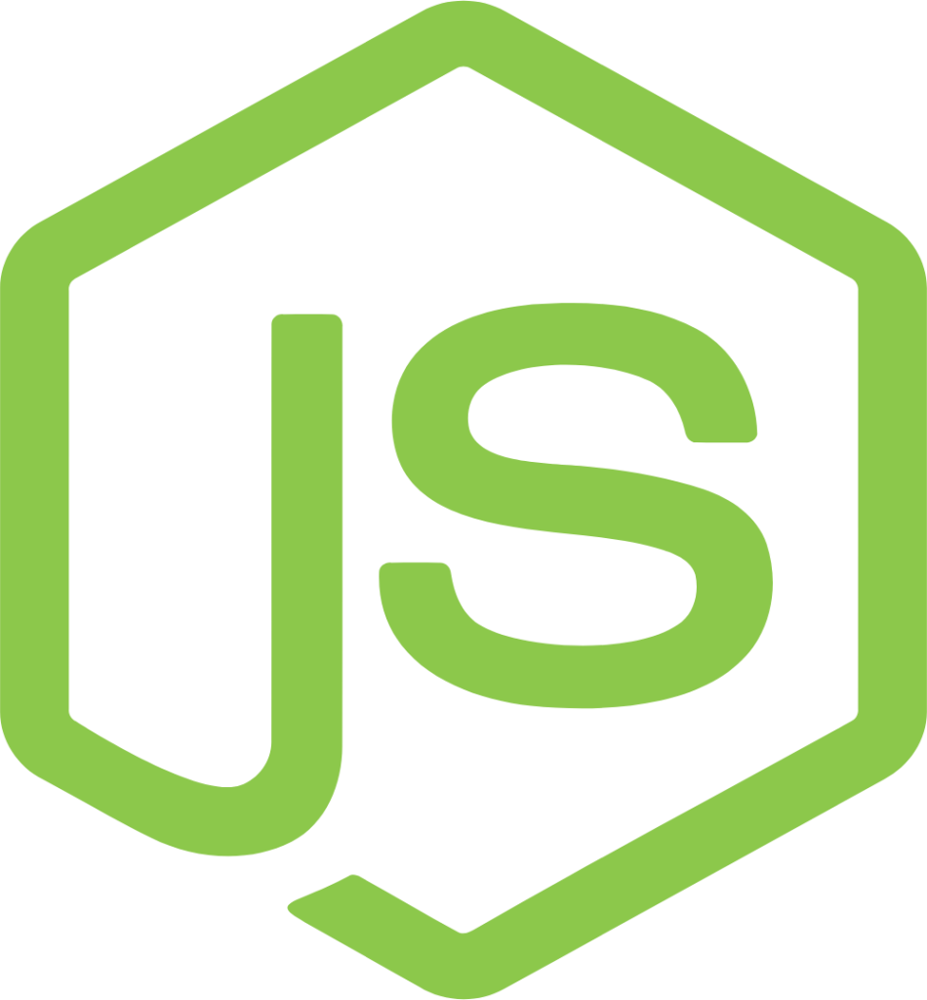
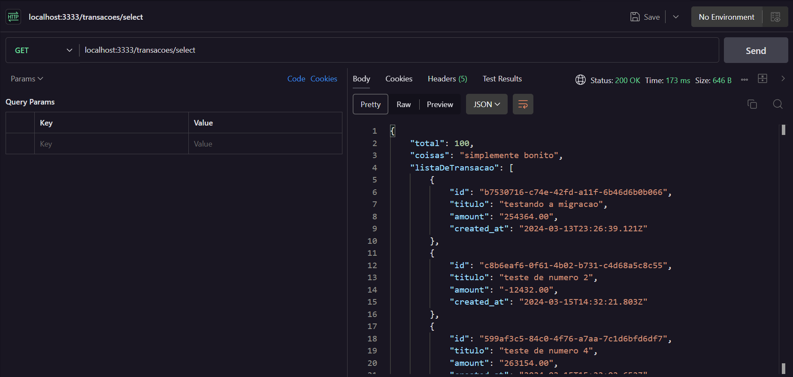

# Projeto de Aprendizado para construir uma API REST com Knex 

<br>

<div style="display: inline_block" align="center">
  
  
  
  
  
  
</div>

<br>

Estarei usando da biblioteca como knex.js e fastify para produzir uma API com o intuito de 
contruir conhcimento em determinadas coisas existentes no node.js e tambem do TypeScript na Aplicacao e entender o que acontece por debaixo dos panos 

<br>

# Requisitos funcionais da aplicacao

- [ x ] o usuario deve criar uma nova transacao
- [ x ] o usuario deve poder obter um resumo da sua conta 
- [ x ] o usuario podera listar todas a transacoes que ja ocorreram
- [ x ] o usuario deve poder visualizar uma transacao unica

<br>

# Requisitos de negocios da aplicacao

- [ x ] a transacao pode ser do tipo credito que somara ao valor total, ou debito subtraira 
- [  ] deve ser possivel ideentificamos usuario entre as requisicoes
- [  ] o usuario so pode visualizar transacoes o qual ele ja criou 

<br>

# Comandos para Estruturacao Basica do Projeto no Terminal

<div style="display: inline_block"align="center" >
  
  
</div>

<br>

comando que é usado para inicializar um novo projeto npm de forma rápida e automática, sem a necessidade de responder a perguntas interativas:
```javascript
npm init -y
```

comando que instala o TypeScript como uma dependência de desenvolvimento em seu projeto:
```javascript
npm i -D typescript 
```
comando usando para inicializar um arquivo de configuração do TypeScript em um projeto,
ele cria um arquivo chamado tsconfig.json no diretório atual 
```javascript
npx tsc --init
```
chamando explicitamente o executável **tsc** localizado no diretório **.bin** dentro do diretório node_modules, é uma forma de executar o compilador TypeScript (tsc) diretamente a partir do diretório node_modules do seu projeto:
```javascript
.\node_modules\.bin\tsc 
```
comando que é usado para compilar o arquivo TypeScript server.ts localizado no diretório src do seu projeto:
```javascript
npx tsc .\src\server.ts 

ou

npx tsx .\src\server.ts 
```
comando que é utilizado para instalar o framework Fastify no seu projeto Node.js
```javascript
npm install fastify
```
o comando é um plugin para o framework Fastify que facilita a manipulação de cookies em aplicativos da web.

Cookies são pequenos pedaços de dados armazenados no navegador do usuário e são frequentemente usados para rastrear informações sobre o usuário ou manter o estado da sessão.
```javascript
npm install @fastify/cookie
```

comando que é utilizado para instalar os tipos de definição de TypeScript para o Node.js no seu projeto. Esses tipos de definição fornecem informações sobre a estrutura e os tipos de dados usados nas bibliotecas do Node.js, o que é útil ao escrever código TypeScript:

```javascript
npm install -D @types/node 
```
instala a biblioteca dotenv para seu projeto. 

O Dotenv é uma biblioteca que permite carregar variáveis de ambiente de um arquivo ***.env*** para ***process.env*** no Node.js. 

Isso é útil para manter informações sensíveis, como chaves de ***API*** ou ***credenciais de banco de dados***, fora do código-fonte e gerenciá-las de forma mais segura.

```javascript
npm install dotenv
```

comando que instala a biblioteca Zod, que é uma biblioteca de validação de esquema para TypeScript e JavaScript. 

Com o Zod, você pode definir esquemas de dados de forma simples e segura e validar dados de entrada em seu aplicativo.

Isso ajuda a garantir que os dados que seu aplicativo recebe estejam no formato esperado, evitando bugs relacionados a dados incorretos ou malformatados.

```javascript
npm install zod 
```

O comando serve para instalar o pacote tsx como uma dependência de desenvolvimento no seu projeto:

OBS:. **tsx** é uma extensão de arquivo usada principalmente em projetos TypeScript para arquivos que contêm código **JSX**

 **JSX** é uma extensão de sintaxe para JavaScript frequentemente associada a bibliotecas como React.js. Permite escrever ***código HTML*** dentro do ***JavaScript*** de uma forma mais intuitiva e expressiva.

 OBS:. mais em producao o mais indicado e roda o java script mesmo 

```javascript
npm install tsx -D 
```
comando que é utilizado para instalar a ferramenta httpie via Python Package Index (PyPI). 

Essa ferramenta é útil para realizar requisições HTTP de maneira simplificada e fácil de usar diretamente da linha de comando no terminal integrado Vs.code

Com o httpie, você pode enviar solicitações HTTP, visualizar as respostas e realizar várias operações comuns de forma rápida e intuitiva.

```javascript
pip install httpie
```
comando que configurando um ambiente onde pode executar arquivos TypeScript diretamente, sem a necessidade de compilar primeiro para JavaScript.

é uma ferramenta que permite executar arquivos TypeScript diretamente no Node.js, sem a necessidade de compilar manualmente para JavaScript antes da execução.

```javascript
npm install ts-node
```
Depois de instalar o ***ts-node***, você pode executar arquivos TypeScript diretamente no terminal, usando o comando

```html
ts-node <nome-do-arquivo>.ts
```
Para desinstalar um pacote do Node.js utilizando o npm, você pode usar o comandoÇ

```html
npm uninstall <nome-do-biblioteca>
```

Testando rota aleatoria usando o httpie no terminal:
```javaScript
http localhost:3333/hello 
```
Este script dev tem que está configurando no  arquivo **package.json** 

Ele iniciará o compilador TypeScript em modo de observação, monitorando o arquivo **src/server.ts** por alterações e recompilando-o sempre que detectar uma mudança
```json
"scripts": {
    "dev": "tsx watch src/serve.ts"
},
```
pode ser executado no terminal com o seguinte comando
```javascript
npm run dev
```
Este script **"lint"** é usado para executar o ESLint nos arquivos **TypeScript (*.ts)** dentro do diretório "src".
```json
"scripts": {
    "lint": "eslint src --ext .ts --fix",
},
```
pode ser executado no terminal com o seguinte comando
```javascript
npm run lint
```

Este comando que instala o ESLint como uma dependência de desenvolvimento no projeto.

**ESLint** é uma ferramenta de análise estática de código para identificar e relatar padrões problemáticos no código JavaScript.
```javascript
npm i eslint -D
```
Este comando instala o ESLint e uma configuração específica fornecida pelo pacote **@rocketseat/eslint-config**, ambos como dependências de desenvolvimento (-D)

```javascript
npm i eslint @rocketseat/eslint-config -D
```
Cria essa parte se no seu settings.json do vs.code usando o CRTL + SHIFT + P  para acessar (open user settings)

Essas configurações estão relacionadas ao ESLint e ao VS Code:
```json
"editor.codeActionsOnSave": {
    "source.fixAll.eslint": "explicit"
},
"eslint.validate": [
    "javascript",
    "javascriptreact",
    "graphql"
],
```
comando que é usado para exibir uma lista das dependências instaladas em um projeto Node.js.

Quando você o executa no diretório raiz de um projeto, ele mostrará todas as dependências 

incluindo as dependências diretas e indiretas (também conhecidas como dependências transitivas)  e suas versões correspondentes.
```javascript
npm list
```
é usado para listar todas as dependências globais instaladas pelo npm.

Ele exibirá todas as dependências globais instaladas no seu sistema 

independentemente do diretório em que você esteja atualmente.
```javascript
npm list -g
```
comando que é usado para executar e inicializa o knex em um projeto Node.js. 

O comando cria um arquivo de configuração **knexfile.js** na raiz do seu projeto 

contendo configurações para conexão com o banco de dados, migrações e sementes.
```json
"scripts": {
    "init_knex": "knex init",
},
```
pode ser executado no terminal com o seguinte comando
```javascript
npm run init_knex
```
é semelhante ao anterior, mas com uma diferença importante: ele usa a opção -x ts para especificar que as migrações geradas devem ter a extensão **.ts** em vez da extensão padrão **.js**

```json
"scripts": {
    "init_knex-ts": "knex init -x ts",
},
```
pode ser executado no terminal com o seguinte comando
```javascript
npm run init_knex-ts
```
comando que é usado para criar um novo arquivo de migração no seu projeto Knex

o Knex cria um novo arquivo de migração com o nome **create-migrations**. 

Esse arquivo será adicionado ao diretório de migrações do seu projeto Knex e você poderá editá-lo para definir as operações que deseja realizar no banco de dados quando executar a migração.

```json
"scripts": {
    "migrate_knex": "knex migrate:make create-migrations",
},
```
pode ser executado no terminal com o seguinte comando
```javascript
npm run migrate_knex
```
comando que é usado para aplicar todas as migrações pendentes ao seu banco de dados. 

o Knex executa todas as migrações que ainda não foram aplicadas ao banco de dados, garantindo que o esquema do banco de dados esteja atualizado com as últimas alterações definidas nos arquivos de migração.

```json
"scripts": {
    "r_knex": "knex migrate:latest",
},
```
pode ser executado no terminal com o seguinte comando
```javascript
npm run r_knex
```
é usado para reverter a última migração aplicada ao banco de dados. 

o Knex desfaz a última migração que foi aplicada, revertendo as alterações no esquema do banco de dados. 

Isso pode ser útil se você cometeu um erro durante uma migração ou precisa desfazer uma alteração específica no banco de dados.

```json
"scripts": {
    "back_knex": "knex migrate:rollback"
},
```
pode ser executado no terminal com o seguinte comando

```javascript
npm run back_knex
```
comando que é usado para carregar variáveis de ambiente de um arquivo .env em sua aplicação Node.js. 

Isso é útil para manter suas configurações sensíveis fora do código-fonte e para fornecer uma maneira fácil de configurar o ambiente de desenvolvimento, teste e produção separadamente.

```javascript
npm install dotenv
```

# Conexão com o Banco de Dados 

<div style="display: inline_block"align="center" >
  
  
  
</div>

<br>

informações de conexão para um banco de dados PostgreSQL.

- **host:** O endereço IP ou nome de host do servidor onde o banco de dados PostgreSQL está sendo executado. Neste caso, está configurado como IP, que é o endereço localhost.

- **port:** A porta em que o PostgreSQL está escutando conexões. Por padrão, o PostgreSQL usa a porta 5432.

- **user:** O nome de usuário usado para autenticar no banco de dados PostgreSQL.

- **password:** A senha associada ao usuário para autenticação no banco de dados PostgreSQL.

- **database:** O nome do banco de dados ao qual você deseja se conectar.

<br>

```typescript
export const knex = setupKnex({
    client: 'string',
    connection: {
        host: 'string',
        port: number,
        user: 'string',
        password: 'string',
        database: 'string',
    }
})
```
outra forma de fazer esta conxão com o banco passando uma URL do banco para o sistema:


```typescript
export const knex = setupKnex({
    client: 'pg',
connection: 'postgres://<nameUser>:<passWord>@localhost:<port>/<nameDataBase>',
    searchPath: ['knex', 'public'],
})
```
<br>

# Metodos HTTP para API com Fastify

<div style="display: inline_block"align="center" >
  
</div>

<br>

os principais ***métodos HTTP*** usados em ***APIs RESTful***, junto com suas descrições:

### 1. GET:
- é usado para solicitar dados de um recurso específico ou uma coleção de recursos.
- É seguro e idempotente, o que significa que não deve alterar o estado do servidor e pode ser chamado várias vezes sem efeitos colaterais.
- Os parâmetros de consulta (query parameters) podem ser adicionados à URL para filtrar, classificar ou paginar os resultados.

### 2. POST:

- O método POST é usado para criar um novo recurso no servidor.

- Os dados a serem enviados são incluídos no corpo (body) da solicitação HTTP.

- Não é idempotente, o que significa que chamar o mesmo endpoint POST várias vezes pode resultar na criação de múltiplos recursos.

### 3. PUT:

- O método PUT é usado para atualizar um recurso existente no servidor ou para criar um novo recurso se ele não existir.


- Normalmente, o corpo da solicitação PUT contém o estado completo do recurso que está sendo atualizado.


- É idempotente, o que significa que chamar o mesmo endpoint PUT várias vezes resultará no mesmo estado do recurso.

### 4. PATCH:

- O método PATCH é usado para aplicar alterações parciais a um recurso existente no servidor.


- Ao contrário do PUT, o corpo da solicitação PATCH contém apenas as mudanças que devem ser aplicadas ao recurso, não o estado completo.


- Também é idempotente, o que significa que chamá-lo várias vezes resultará no mesmo estado final.

### 5. DELETE:

- O método DELETE é usado para remover um recurso específico do servidor.


- Não possui corpo de solicitação, pois só precisa da identificação do recurso a ser excluído.


- É idempotente, o que significa que chamar o mesmo endpoint DELETE várias vezes não terá efeitos além da primeira exclusão.

<br>

## Configurando o Arquivo knexfile.js ou knexfile.ts

<div style="display: inline_block"align="center" >
  
</div>

<br>

fazendo as config corretas para o arquivo quando criado para que fucione corretamente no projeto.

vc pode passa o seguintes parametros necessarios:


```javascript
module.exports = {
  development: {
    client: String,
    connection: {
      database: String,
      user: String,
      password: String Number,
    },
    migrations: {
      extension: 'js',
      directory: './migrations',
      tableName: 'knex_migrations_users',
    },
  },

  staging: {
    client: String,
    connection: {
      database: String,
      user: String,
      password: String Number,
    },
    pool: {
      min: 2,
      max: 10,
    },
    migrations: {
      tableName: 'knex_migrations_users',
    },
  },

  production: {
    client: String,
    connection: {
      database: String,
      user: String,
      password: String Number,
    },
    migrations: {
      tableName: 'knex_migrations_users',
    },
  },
}
```
<br>

nome na tabela da migration é opcional para cada projeto.

OBS:. por padrao a documentacao indica vc usar o arquivo ***.js*** que no meu caso funcionou perfeitamente para fazer as migrations 

### Em Resumo,é um arquivo de configuração usado pela biblioteca Knex.js para definir e configurar conexões com bancos de dados, bem como especificar opções para migrações e sementes de dados. Este arquivo geralmente contém diferentes configurações para diferentes ambientes, como desenvolvimento, teste e produção, cada um com suas próprias configurações de conexão e opções específicas

## Adcionando config no ***package.json***

<div style="display: inline_block"align="center" >
  
</div>

<br>

Ao adicionar ***"type": "module"*** ao seu arquivo package.json, você está informando ao Node.js que o seu projeto utilizará o sistema de módulos ECMAScript (ESM) em vez do sistema de módulos CommonJS padrão.

ou seja,

Isso significa que você pode usar a sintaxe import e export para importar e exportar módulos, em vez de ***require()*** e ***module.exports***. 

Isso segue o padrão do JavaScript moderno e é mais consistente com outras plataformas e ambientes de desenvolvimento.

```json
{
  "name": "api-rest-com-node",
  "version": "1.0.0",
  "type": "module", //colocando aqui 
  "description": "",
  "main": "index.js",
}
```
tambem existe outra parte do arquivo que se refere a atalhor de comandos no terminal para usar quando necessario para fazeer o projeto funcionar 

```json
"scripts": {
    "dev": "tsx watch src/server.ts",
    "lint": "eslint src --ext .ts --fix",
    "init_knex": "knex init",
    "init_knex-ts": "knex init -x ts",
    "migrate_knex": "knex migrate:make create-migrations",
    "r_knex": "knex migrate:latest",
    "back_knex": "knex migrate:rollback --all"
  },
```

OBS:. mais acima mostrei como vc pode usar para fazer cada parte do script funcionar no terminal de uma olha mais acima a onde fala sobre ***Comandos para Estruturacao Basica do Projeto no Terminal***

ja nessa outra partee aqui estao as versoes utilizadas tanto da bibliotecas locais do projeto mais de dependencias de desenvolvimento inclusas para que o projeto rode perfeitamente na maquina.

```json
"devDependencies": {
    "@rocketseat/eslint-config": "^2.2.2",
    "@types/node": "^20.11.24",
    "eslint": "^8.57.0",
    "tsx": "^4.7.1",
    "typescript": "^5.3.3"
  },
  "dependencies": {
    "dotenv": "^16.4.5",
    "fastify": "^4.26.2",
    "knex": "^3.1.0",
    "pg": "^8.11.3",
    "ts-node": "^10.9.2",
    "zod": "^3.22.4"
  }
```

## Expliando o que é um Migration no ***knex.js*** ??

<div style="display: inline_block"align="center" >
  
</div>

<br>

Uma migração em um projeto com Knex é um conceito usado para gerenciar e versionar o esquema do banco, ou seja, a modificacao de estrutura do banco de dados, de forma controlada e automatizada.

### Controle de Versão do Banco de Dados: 

- As migrações permitem que você versione o esquema do banco de dados, 

- o que significa que você pode acompanhar as alterações no esquema ao longo do tempo, 

- permitindo que você reverta para versões anteriores se necessário.

### Alterações no Esquema: 

- As migrações podem conter alterações no esquema do banco de dados, como criar, alterar ou excluir tabelas, adicionar ou remover colunas, definir chaves estrangeiras, criar índices, entre outras operações.

### Arquivos de Migração:

- Cada migração é representada por um arquivo no sistema de arquivos do seu projeto. 

- Esse arquivo contém as instruções SQL ou métodos JavaScript necessários para realizar as alterações desejadas no esquema do banco de dados.

### Execução Sequencial: 

- As migrações são executadas em ordem sequencial, garantindo que as alterações no esquema sejam aplicadas na ordem correta. 

- Isso é fundamental para evitar conflitos e garantir a consistência do banco de dados.

### Rollback: 

- Além de aplicar migrações para atualizar o esquema do banco de dados, 

- o Knex também oferece a capacidade de reverter ou desfazer migrações, 

- o que permite reverter para um estado anterior do esquema do banco de dados se necessário.

### Gerenciamento Automático de Esquema: 

- As migrações podem ser aplicadas e revertidas de forma automática por meio de comandos específicos fornecidos pelo Knex CLI (Command Line Interface), 

- facilitando o gerenciamento e a manutenção do esquema do banco de dados ao longo do ciclo de vida do projeto.

### Expliando o ***exports.up*** e tambem ***exports.down***

No contexto do Knex e das migrações de banco de dados, ***exports.up*** e ***exports.down*** são funções utilizadas para definir as operações de migração que serão executadas quando você aplicar ***(up)*** ou reverter ***(down)*** uma migração.

```javascript
exports.up = function (knex) { }

exports.down = function (knex) { }
```
### Exports.up: 

- Esta função define as operações que serão realizadas quando você aplicar a migração. Ela é responsável por adicionar ou modificar a estrutura do banco de dados de acordo com as alterações definidas no script de migração. 

### Por exemplo

- você pode usar o método knex.schema.createTable para criar uma nova tabela, adicionar colunas a uma tabela existente ou fazer outras alterações no esquema do banco de dados.

```javascript
exports.up = function (knex) { 
  return knex.schema.createTable('users', function(table) {
    table.increments('id').primary();
    table.string('username').notNullable();
    table.string('email').notNullable().unique();
    table.timestamps(true, true);
  });
}
```
### exports.down: 

- Esta função define as operações que serão realizadas quando você reverter a migração. Ela é responsável por desfazer as alterações feitas pela migração up, restaurando o banco de dados ao seu estado anterior. 

### Por exemplo 

- você pode usar o método knex.schema.dropTable para excluir uma tabela criada na migração up.

```javascript
exports.down = function (knex) {
  return knex.schema.dropTable('users');
}
```


A mesma propriedade de configuração pode ser usada para habilitar a migração por transação caso a configuração comum tenha ***disableTransactions: true***

```javascript
exports.config = { transaction: true }
```

Quando ***transaction*** é definido como ***true*** nas configurações de migração, cada migração é executada dentro de uma transação. 

Isso garante que, se ocorrer um erro durante a execução de uma migração, o Knex reverta automaticamente todas as alterações feitas por essa migração, mantendo o banco de dados em um estado consistente.

### Em Resumo, As migrações são usadas para garantir que as alterações no esquema do banco de dados sejam aplicadas de forma controlada e reversível, permitindo que você mantenha um histórico das alterações feitas ao longo do tempo e que possa compartilhar e reproduzir essas alterações em diferentes ambientes de desenvolvimento e produção.

## Arquivo ***knex.d.ts*** Explicacao:

<div style="display: inline_block"align="center" >
  
</div>

<br>

O arquivo ***knex.d.ts*** é um arquivo de definição de tipo para o ***Knex.js***

uma biblioteca de construção de consultas e outros comandos SQL para Node.js. 

Esse arquivo geralmente contém declarações de tipos TypeScript que ajudam o compilador a entender a estrutura e os tipos de objetos usados ​​pelo Knex.js.

Por exemplo:.

```typescript
import { Knex } from 'knex'

declare module 'knex/types/tables' {
    export interface Tables {
        transacoes: {
            id: string
            titulo: string
            amount: number
            created_at: string
            session_id?: string
        }
    }
}
```

### Ao usar o Knex.js com TypeScript, é comum encontrar um arquivo knex.d.ts que fornece essas definições de tipo para que o TypeScript possa fazer inferências de tipo corretamente durante o desenvolvimento. 

### Isso ajuda a evitar erros e oferece um ambiente de desenvolvimento mais produtivo.
 
## Arquivo ***.eslintrc.json*** Explicacao:

<div style="display: inline_block"align="center" >
  
</div>

<br>

O arquivo .eslintrc.json é um arquivo de configuração para o ESLint 

uma ferramenta de análise estática de código para identificar problemas no código JavaScript.

Este arquivo define as regras e configurações que o ESLint usará ao analisar o código-fonte do seu projeto.

trazendo Exemplo de codigo 

```json
{
  "extends": "eslint:recommended",
  "rules": {
    "semi": ["error", "always"],
    "indent": ["error", 2],
    "quotes": ["error", "single"]
  }
}
```

- A chave "extends" especifica que estamos estendendo as configurações recomendadas do ESLint, que são um conjunto padrão de regras.


- A chave "rules" permite que você defina regras específicas. 

- Por exemplo, estamos configurando a regra semi para exigir ponto e vírgula no final das linhas

- a regra indent para exigir indentação de 2 espaços e a regra quotes para exigir o uso de aspas simples para strings

### Em resumo, Ele permite definir um padrão de codificação consistente e pode ajudar a identificar erros comuns ou problemas de estilo no seu código JavaScript.


## Arquivo ***.gitignore*** Explicacao:

<div style="display: inline_block"align="center" >
  
</div>

<br>

 é um arquivo de configuração usado para especificar quais arquivos e diretórios o Git deve ignorar ao rastrear as alterações em um repositório Git. 

 Por exemplo:.

 ```.gitignore
# Arquivos de compilação
*.o
*.out
*.exe

# Diretórios de dependências
node_modules/
venv/

# Arquivos de ambiente locais
.env

# Arquivos de build
/build

# Arquivos de logs
logs/
*.log
```
 
### Isso significa que os arquivos e diretórios listados no .gitignore não serão incluídos nas operações de git add e git commit, tornando-os essencialmente invisíveis para o Git.

## Explicando a Biblioteca ***Zod*** usada no Projeto

<div style="display: inline_block"align="center" >
  
</div>

<br>

é uma biblioteca de validação de esquemas em TypeScript que oferece uma maneira simples e poderosa de definir e validar objetos de dados de acordo com um esquema predefinido. 

Ela é útil para garantir que os dados recebidos em um aplicativo atendam a determinadas expectativas e requisitos antes de serem processados ou armazenados. 

### Tipos de Dados: 

- Zod oferece uma variedade de tipos de dados incorporados, como ***string***, ***number***, ***boolean***, ***array***, ***object***, etc. 

- Além disso, ele permite definir tipos de ***dados personalizados*** e compostos, como tipos de ***dados aninhados***, ***uniões de tipos***, ***arrays de tipos específicos***,


Trazendo um exemplo simples para isso para que possa entender melhor:. 

```typescript
import { z } from 'zod';

// Definindo um esquema de validação para um objeto de usuário
const userSchema = z.object({
  id: z.string().uuid(), // ID do usuário como uma string UUID
  username: z.string().min(4).max(20), // Nome de usuário entre 4 e 20 caracteres
  email: z.string().email(), // Email válido
  age: z.number().int().positive().min(18), // Idade como número inteiro positivo maior que 18
  isAdmin: z.boolean(), // Booleano indicando se o usuário é um administrador
});

// Validando os dados de usuário em relação ao esquema
try {
  const validatedUser = userSchema.safeParse(process.env);
  console.log('Dados de usuário válidos:', validatedUser);
  
  // Exportando os dados validados para uso posterior
  export const env = userSchema.data
} catch (error) {

  // mostrando messagem dee erro para os usuario no terminal 
  console.error('Erro ao validar dados de usuário:', error.message);
}
```
  ### No geral, o Zod é uma ferramenta valiosa para garantir a integridade e a consistência dos dados em aplicativos TypeScript, ajudando a evitar bugs relacionados a tipos de dados inválidos e simplificando a validação de entrada de dados.

## Explicando a Biblioteca ***dotenv*** que estara sendo usanda no projeto

<div style="display: inline_block"align="center" >
  
</div>

<br>

é uma ferramenta comum em projetos Node.js que ajuda a carregar variáveis de ambiente de arquivos .env para o processo de ambiente do Node.js. 

### Variáveis de Ambiente: 

- Variáveis de ambiente são variáveis externas ao código-fonte que podem influenciar o comportamento do programa. 

- Elas são frequentemente usadas para configurar aplicativos de forma flexível sem a necessidade de modificar o código fonte. 

- Exemplos comuns de variáveis de ambiente incluem configurações de banco de dados, chaves de API, URLs de serviços externos, entre outros.

### Arquivo .env: 

- O arquivo .env é um arquivo de texto simples que contém pares de chave-valor das variáveis de ambiente. 

- Cada linha no arquivo .env segue o formato CHAVE=VALOR. 

Por exemplo:

```json
DB_HOST=localhost
DB_USER=myuser
DB_PASSWORD=mypassword
```

### Em resumo, a biblioteca dotenv é uma ferramenta valiosa para gerenciar variáveis de ambiente em aplicativos Node.js, facilitando a configuração e garantindo a segurança das informações confidenciais do seu projeto.

## Usando a Extensão do Postman no Vs.code

<div style="display: inline_block"align="center" >
  
</div>

<br>

Esta extensão permite que você envie solicitações HTTP diretamente do seu editor de código e visualize as respostas diretamente no VS Code, o que pode ser útil durante o desenvolvimento de APIs e serviços da web.

Com a extensão "REST Client", você pode criar arquivos de texto com extensão .http ou .rest e escrever solicitações HTTP dentro deles usando uma sintaxe semelhante à do Postman. Por exemplo:

<div style="display: inline_block"align="center" >
  
</div>

<br>

A resposta será exibida diretamente no VS Code, permitindo que você visualize e analise as respostas de suas solicitações HTTP sem precisar alternar entre diferentes aplicativos.